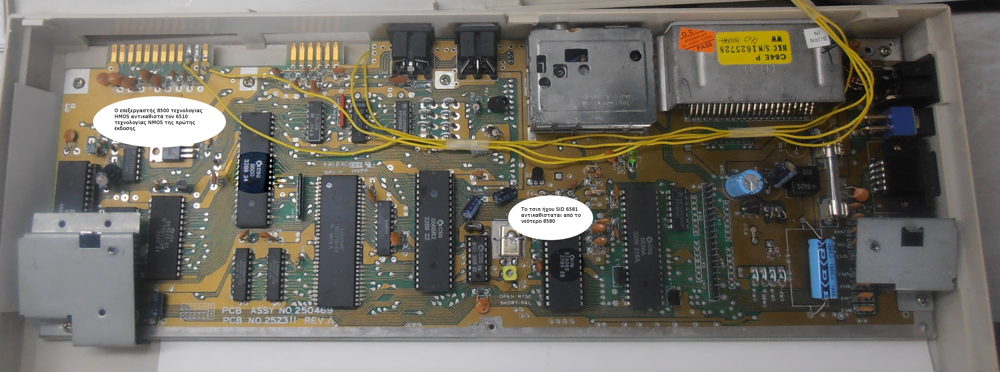

# Assembly 250469 Rev. A

Original board:

(_From the [C64-Wiki](https://www.c64-wiki.com/wiki/Motherboard)_)

## Files

- Schematics in PDF: [C64C-250469-01-A.pdf](C64C-250469-01-A.pdf)
- Complete BOM in LibreOffice Calc format, including part numbers from Digi-Key and Mouser
  [C64C-250469-01-A.ods](C64C-250469-01-A.ods)

## Status

I am quite confident that the schematic is stable and bug-free.

**Good News!** I acquired a spare motherboard that matches exactly this revision.
With this example in my hand, I corrected all dimensional errors in the PCB.
I also placed with great precision all the external connectors.
Now work on routing the PCB can begin!
